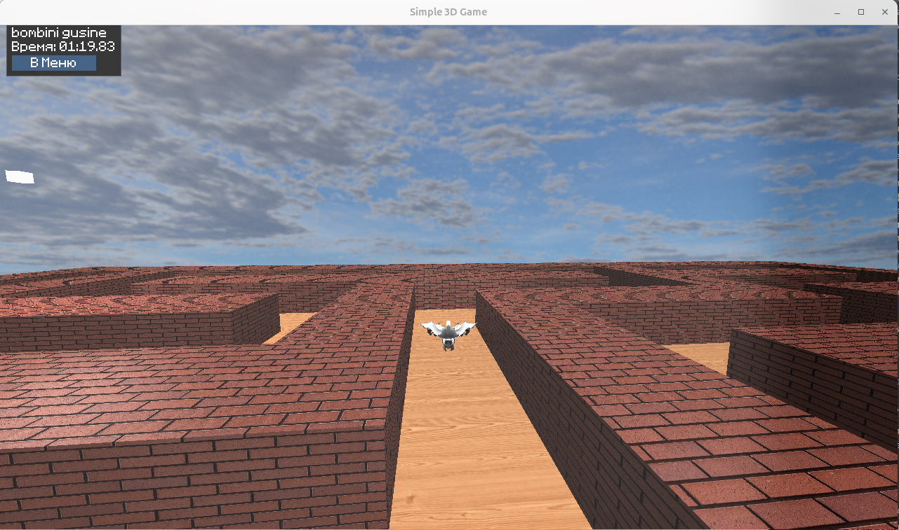

\
# Game_OpenTK

Простой 3D-проект, разработанный на C# с использованием OpenTK для графики и ImGui для пользовательского интерфейса. Демонстрирует базовые концепции 3D-графики, включая рендеринг моделей, скайбокс, управление камерой и простой игровой цикл с лабиринтом.

## Основные возможности

*   **3D Рендеринг**: Отображение 3D-моделей и сцен с использованием OpenTK (OpenGL).
*   **Скайбокс**: Реализация скайбокса для создания окружения.
*   **Пользовательский интерфейс**: Интеграция с ImGui.NET для создания меню и внутриигрового интерфейса (главное меню, игровой интерфейс, экран окончания игры).
*   **Управление камерой**: Базовая реализация камеры от первого лица.
*   **Генерация лабиринта**: Процедурная генерация простого лабиринта.
*   **Система логирования**: Запись событий игры в текстовые файлы.
*   **Архитектура ECS**: Использование паттерна Entity-Component-System для управления игровыми объектами и логикой.

## Используемые технологии

*   **C#**: Основной язык программирования.
*   **.NET 8**: Платформа разработки.
*   **OpenTK**: Библиотека для низкоуровневого доступа к OpenGL, OpenCL и OpenAL.
*   **ImGui.NET**: .NET обертка для популярной графической библиотеки пользовательского интерфейса Dear ImGui.
*   **StbImageSharp**: Библиотека для загрузки изображений.
*   **CjClutter.ObjLoader**: Библиотека для загрузки моделей в формате .obj.

## Структура проекта

*   **`Assets/`**: Содержит игровые ресурсы:
    *   `Fonts/`: Файлы шрифтов (например, для ImGui).
    *   `Models/`: 3D-модели (например, в формате `.obj`) и их материалы (`.mtl`).
    *   `Shaders/`: GLSL шейдеры (вершинные и фрагментные).
    *   `Textures/`: Текстуры для моделей и скайбокса.
*   **`bin/`**: Выходная директория сборки проекта.
*   **`Config/`**: Конфигурационные файлы и классы для настроек игры.
*   **`Core/`**: Основная логика игры:
    *   `ECS/`: Реализация Entity Component System.
        *   `Components/`: Компоненты для сущностей.
        *   `Systems/`: Системы, обрабатывающие сущности с определенными компонентами.
    *   `Logging/`: Система логирования.
    *   `Utils/`: Вспомогательные утилиты (например, генератор лабиринта).
    *   `Camera.cs`: Логика камеры.
    *   `Game.cs`: Основной класс игры, управляет игровым циклом.
    *   `GameStateManager.cs`: Управление состояниями игры (меню, игра, конец игры).
    *   `World.cs`: Управление игровым миром, объектами и скайбоксом.
*   **`Logs/`**: Файлы логов, генерируемые во время работы приложения.
*   **`Models/`**: Классы для работы с 3D-моделями и мешами.
*   **`obj/`**: Промежуточные файлы сборки.
*   **`Rendering/`**: Классы, связанные с рендерингом:
    *   `ImGuiController.cs`: Управление и рендеринг ImGui.
    *   `Shader.cs`: Загрузка и управление GLSL шейдерами.
    *   `Skybox.cs`: Логика рендеринга скайбокса.
    *   `Texture.cs`: Загрузка и управление текстурами.
*   **`UI/`**: Классы для управления пользовательским интерфейсом (например, `UIManager.cs` для ImGui).
*   **`Program.cs`**: Точка входа приложения.
*   **`Game_OpenTK.csproj`**: Файл проекта C#.

## Сборка и запуск

### Требования
*   [.NET 8 SDK](https://dotnet.microsoft.com/download/dotnet/8.0) или новее.

### Инструкции
1.  Клонируйте репозиторий:
    ```bash
    git clone <URL_РЕПОЗИТОРИЯ>
    cd Game_OpenTK_
    ```
2.  Соберите проект:
    ```bash
    dotnet build
    ```
3.  Запустите проект:
    ```bash
    dotnet run --project Game_OpenTK.csproj
    ```
    Или запустите исполняемый файл напрямую из директории `bin/Debug/net8.0/`.

## Возможные улучшения

*   Более сложная генерация лабиринтов.
*   Добавление врагов или NPC.
*   Реализация физики.
*   Улучшенная система освещения (тени, несколько источников света).
*   Более интерактивные элементы UI.
*   Оптимизация производительности.
